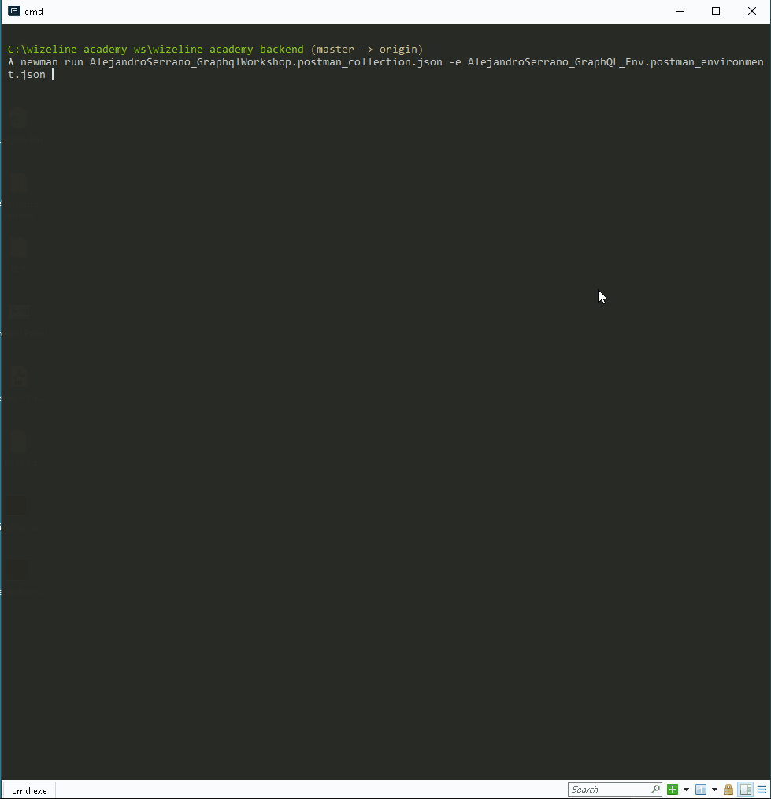

# Wizeline FullStack QA Certification - Back End - GraphQL
This repository contains a practice of what we learned in the Wizeline FullStack QA Certification Day 2.

## Getting Started
1. Ensure that [Node.js](https://nodejs.org/en/) and npm are installed on your computer.
2. Install [Postman](https://www.postman.com/) and [GraphiQL](https://github.com/graphql/graphiql) on your computer.
3. Clone this repository or download the zip with the json files in to your local system.
```
git clone https://github.com/alejandro-serrano/wizeline-academy-backend.git
```
4. Change directory to the folder where the code of this project lives in your local system.
5. Install newman.
```
npm install -g newman
```
## Running the collection
1. You can run the tests suite from a command shell by calling the following command.
```
newman run AlejandroSerrano_GraphqlWorkshop.postman_collection.json -e AlejandroSerrano_GraphQL_Env.postman_environment.json
```
2. You can also run the collection by importing the files in the repo to Postman and run them from there.

## Demo

